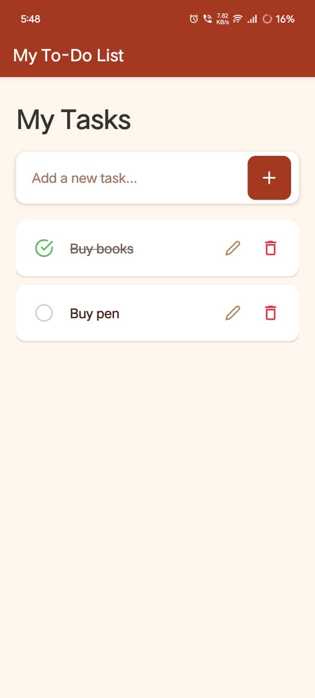

# ToDoList App

## 📌 Overview
This project is a simple and intuitive mobile application for managing daily tasks, built with **React Native** and **Expo**.

## ✨ Features
- **Task Management:** Add, edit, and delete to-do items.
- **Task Status:** Mark tasks as complete.
- **Persistence:** Local saving of tasks.
- **User-Friendly Interface:** Clean and straightforward design.

## 🛠️ Tech Stack
- **Framework:** React Native
- **Platform:** Expo
- **Language:** JavaScript

## 📂 Project Structure
```bash
.
├── .expo/
│   ├── devices.json
│   ├── packager-info.json
│   └── settings.json
├── assets/
│   ├── adaptive-icon.png
│   ├── favicon.png
│   ├── my_icon.png
│   ├── screenshort.jpg
│   └── splash.png
├── components/
│   └── TaskItem.js
├── node_modules/
├── screens/
│   ├── EditTaskScreen.js
│   └── TaskListScreen.js
├── .gitignore
├── App.js
├── app.json
├── package-lock.json
├── package.json
└── README.md
```

## 🚀 Setup Steps
Follow these steps to get your ToDoList app up and running on your local machine.
### Prerequisites
- **Node.js & npm (or Yarn):** Make sure you have Node.js and a package manager (npm or Yarn) installed. You can download Node.js from nodejs.org.
- **Expo CLI:** Install Expo CLI globally using npm or yarn:
```bash
    npm install -g expo-cli
    # OR
    yarn global add expo-cli
```
- **Expo Go App:** Install the Expo Go app on your physical iOS or Android device from your respective app store, or set up an Android emulator or iOS simulator.
### Installation
- **Clone the Repository:**
```bash
    git clone <your-repository-url>
    cd ToDoList
```
- **Install Dependencies:**
```bash
    npm install
    # OR
    yarn install
```
- **Start the Expo Development Server:**
```bash
    expo start
    Use code with caution.
```
This command will open a browser window with the Expo Dev Tools and display a QR code in your terminal.

## 📱 How to Run the App
### On a Physical Device (with Expo Go)
- Open the Expo Go app on your smartphone.
- Scan the QR code displayed in your terminal using the Expo Go app.
- The app will load on your device.
### On an Emulator/Simulator
- **Android Emulator:**
  - Ensure you have Android Studio installed and an Android Virtual Device (AVD) configured.
  - In your terminal (where expo start is running), press a to open the app on your Android emulator.
- **iOS Simulator (macOS only):**
  - Ensure you have Xcode installed and an iOS simulator configured.
  - In your terminal (where expo start is running), press i to open the app on your iOS simulator.

## 📸 Screenshot

